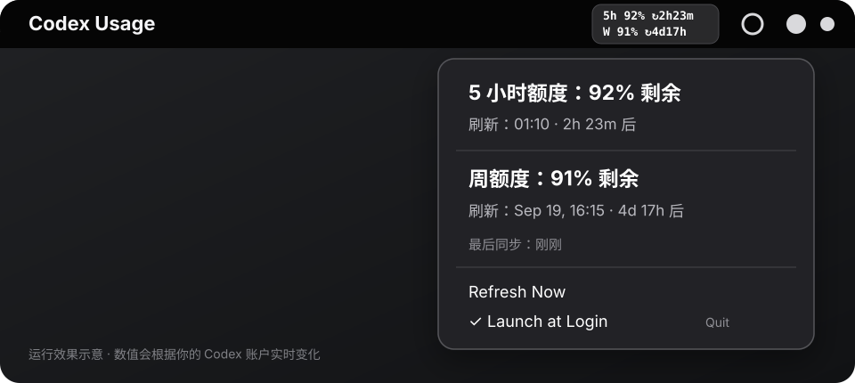

# Codex Usage Menubar

一个轻量、原生的 macOS 菜单栏工具，实时查看 ChatGPT 账户中的 Codex **5 小时额度**和**周额度**。

它通过本机 Codex 自带的 `app-server` 获取额度，不读取浏览器 Cookie、OpenAI 密码、API Key 或 Codex 登录 Token。

> 非官方社区项目，与 OpenAI 无隶属或背书关系。Codex、ChatGPT 和 OpenAI 是 OpenAI 的商标。



## 功能

- 状态栏上下两行同时显示 5 小时和周额度。
- 每行包含剩余百分比与距离刷新的时间。
- 根据实际文字宽度动态收缩，不占用多余菜单栏空间。
- 点击后查看精确刷新时间、倒计时和最后同步时间。
- 每 60 秒自动刷新，也可以手动刷新。
- 支持登录时自动启动。
- 使用原生 Swift 与 AppKit，无第三方运行时依赖。
- 不读取 Cookie、认证文件、对话内容或项目文件。

状态栏示例：

```text
5h 92% ↻2h23m
W  91% ↻4d17h
```

这里显示的是**剩余额度**，不是已使用额度。

## 系统要求

- macOS 13 Ventura 或更高版本。
- Apple Command Line Tools，或完整 Xcode。
- 已登录 ChatGPT 账户的 ChatGPT/Codex 桌面应用，或已登录的独立 Codex CLI。

安装 Command Line Tools：

```bash
xcode-select --install
```

如果已经安装但编译时提示 Swift 与 SDK 版本不一致，请在“系统设置 → 通用 → 软件更新”中更新 Command Line Tools，或安装完整 Xcode。

## 安装

### 方法一：终端安装

```bash
git clone https://github.com/LeiZhou-AC/codex-usage-menubar.git
cd codex-usage-menubar
zsh "Install Codex Usage.command"
```

安装脚本会：

1. 自动寻找 ChatGPT、Codex App 或独立 Codex CLI 内的 `codex` 可执行文件。
2. 在本机编译 Swift 源码。
3. 创建并临时签名 `Codex Usage.app`。
4. 安装到 `~/Applications/Codex Usage.app`。
5. 创建用户级 LaunchAgent，默认开启登录启动。
6. 立即启动菜单栏应用。

如果 macOS 阻止脚本运行，请打开“系统设置 → 隐私与安全性”，仅允许本次下载的安装脚本，然后重新执行。

### 方法二：Finder 安装

1. 下载并解压项目源码。
2. 双击 `Install Codex Usage.command`。
3. 按 macOS 提示允许执行。
4. 在屏幕右上角寻找双行额度显示。

## 使用

安装后无需额外配置。应用每 60 秒自动读取一次额度：

```text
5h 92% ↻2h23m
W  91% ↻4d17h
```

- `5h`：5 小时滚动窗口。
- `W`：周额度窗口。
- `92%`：剩余额度。
- `↻2h23m`：距离该额度刷新的时间。

点击状态栏项目可以查看：

- 两个窗口的剩余额度；
- 精确刷新日期和时间；
- 距离刷新的倒计时；
- 最后同步时间；
- `Refresh Now` 手动刷新；
- `Launch at Login` 登录启动开关；
- `Quit Codex Usage` 退出应用。

## 工作原理

```text
Codex Usage Menubar
        │
        ├─ 启动：codex app-server --listen stdio://
        │
        ├─ JSON-RPC 初始化握手
        │
        └─ 请求：account/rateLimits/read
                         │
                         ├─ usedPercent
                         ├─ windowDurationMins
                         └─ resetsAt
```

应用优先读取 `rateLimitsByLimitId.codex`，并兼容旧版返回的 `rateLimits`。它根据 `windowDurationMins` 识别 5 小时和周窗口，因此不会因为 `primary`、`secondary` 顺序变化而把两个额度显示反。

剩余额度计算方式：

```text
remainingPercent = 100 - usedPercent
```

应用自身不直接实现 OpenAI HTTP 请求。网络请求和账户认证由本机已登录的 Codex app-server 处理。

## 隐私与安全

应用不会读取：

- `~/.codex/auth.json`；
- 浏览器 Cookie；
- OpenAI 密码或 API Key；
- Codex 对话、Prompt 或历史记录；
- 代码仓库、项目文件或剪贴板；
- ChatGPT 页面内容。

应用会在本机保存：

- 检测到的 Codex 可执行文件路径；
- 本地启动、刷新和错误日志；
- 启用登录启动时的用户级 LaunchAgent。

成功的额度响应只在内存中解析，不会完整写入磁盘。详细说明见 [PRIVACY.md](PRIVACY.md)。

## 安装位置

```text
~/Applications/Codex Usage.app
```

记录的 Codex 路径：

```text
~/Library/Application Support/Codex Usage/codex-path
```

登录启动配置：

```text
~/Library/LaunchAgents/com.codexusage.menubar.plist
```

本地日志：

```text
~/Library/Logs/CodexUsage.log
~/Library/Logs/CodexUsage-appserver.log
```

分享日志前请检查并移除可能包含的本机路径。

## 手动编译

```bash
mkdir -p .build/ModuleCache
xcrun swiftc \
  -module-cache-path .build/ModuleCache \
  -O \
  -framework Cocoa \
  src/CodexUsageMenu.swift \
  -o .build/CodexUsage
```

安装脚本还会创建标准 `.app` 目录、生成 `Info.plist` 并执行 ad-hoc 签名。若要向其他用户分发预编译应用，需要使用自己的 Apple Developer 证书进行签名和公证。

## 更新

```bash
cd codex-usage-menubar
git pull
zsh "Install Codex Usage.command"
```

重新运行安装脚本会停止旧版本、覆盖应用并重新启动，不会影响 Codex 登录状态。

## 卸载

在项目目录执行：

```bash
zsh "Uninstall Codex Usage.command"
```

卸载脚本会删除菜单栏应用和 LaunchAgent。诊断日志会保留，方便排查问题；如不需要，可以手动删除：

```bash
rm "$HOME/Library/Logs/CodexUsage.log"
rm "$HOME/Library/Logs/CodexUsage-appserver.log"
```

## 故障排查

### 状态栏显示 `--`

1. 打开 ChatGPT/Codex，确认已经登录正确账户。
2. 点击状态栏项目中的 `Refresh Now`。
3. 检查 `~/Library/Logs/CodexUsage-appserver.log`。
4. 确认 Codex CLI 可以正常运行：

```bash
codex login status
```

### 找不到状态栏项目

重新启动：

```bash
open "$HOME/Applications/Codex Usage.app"
```

菜单栏项目较多时，macOS 可能隐藏空间不足的项目。退出一个不需要的菜单栏程序后重试。本项目会根据文字宽度动态收缩，但仍需保留显示两行额度所需的最小空间。

### 额度没有立即变化

- 应用默认每 60 秒刷新一次。
- 点击 `Refresh Now` 可以立即请求一次。
- Codex 服务端统计本身可能存在短暂延迟。

### 编译器与 SDK 版本不匹配

更新 Xcode Command Line Tools。安装脚本会把 Swift 模块缓存放在项目的 `.build/ModuleCache` 中，避免系统缓存目录权限问题。

## 项目结构

```text
.
├── src/CodexUsageMenu.swift       # 数据读取、额度解析和菜单栏 UI
├── Install Codex Usage.command    # 本地编译、安装和登录启动
├── Uninstall Codex Usage.command  # 卸载
├── PRIVACY.md                     # 隐私与数据访问说明
├── LICENSE                        # MIT License
└── assets/                        # README 展示素材
```

## 与上游版本的区别

本项目基于 [gameofbitcoins/codex-usage-menubar](https://github.com/gameofbitcoins/codex-usage-menubar) 修改，保留其通过 Codex app-server 读取额度的安全设计。

主要改进：

- 状态栏同时显示 5 小时和周额度；
- 两行紧凑布局，每行包含刷新倒计时；
- 使用固定高度的模板图像，避免文字突破菜单栏边界；
- 根据真实文字宽度动态调整状态栏宽度，减少无意义空白；
- 点击菜单使用原生菜单项，避免自定义宽菜单在屏幕边缘被裁切；
- 根据窗口时长识别 5 小时与周额度；
- 为旧版 Swift 工具链增加独立模块缓存路径；
- 补充中文使用、安装、隐私和排障文档。

感谢原项目作者提供基础实现。本仓库继续遵循原项目的 MIT License。

## English summary

Codex Usage Menubar is an unofficial native macOS status-bar utility for monitoring the remaining Codex 5-hour and weekly usage windows. It talks only to the locally installed Codex app-server through `account/rateLimits/read`, dynamically sizes its compact two-line status item, refreshes every 60 seconds, and does not read browser cookies or authentication files.

## License

[MIT License](LICENSE)
